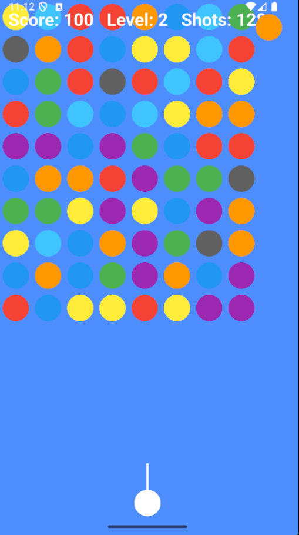

# 🎯 Bubble Shoot 🎮

## 🌟 About the Game

Bubble Shoot is an exciting bubble shooter game built with Flutter and the Flame game engine! Test your aiming skills, strategy, and quick thinking as you match and pop colorful bubbles to clear the board.

## 👨‍💻 Developer

Developed with ❤️ by **İsmail Hakkı Kemikli** ([@ismailhakkii](https://github.com/ismailhakkii))

## ✨ Features

- 🎨 Colorful bubble popping action
- 🔊 Engaging sound effects
- 📊 Score tracking system
- 📱 Optimized for portrait mode
- 🎮 Intuitive touch controls
- 🎯 Simple yet addictive gameplay
- 🚀 Multiple challenging levels
- 🏆 Achievement system to unlock
- 🌈 Power-ups to discover

## 📱 Screenshots

## 🚀 Getting Started

### Prerequisites

- Flutter SDK
- Dart SDK
- Android Studio / VS Code

### Installation

1. Clone the repository:
